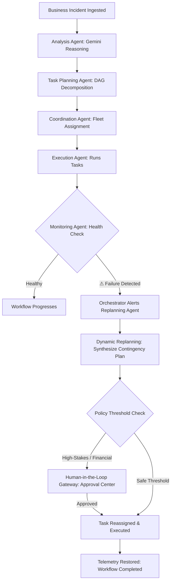

# WorkFlowX AI ⚡
### Autonomous Multi-Agent Workflow Intelligence System
> *“Understand. Plan. Delegate. Execute. Adapt.”*

[](https://github.com)
[](https://deepmind.google/technologies/gemini/)
[](https://supabase.com)
[](https://render.com)

---

## 🌟 Executive Overview & Problem Statement

Modern enterprise operations struggle with broken workflows: fragmented business incidents (e.g. unfulfilled orders, payment disputes, logistic delays, system outages) require manual triage, cross-departmental coordination, and constant troubleshooting. Traditional workflow automation is static and fragile—when a step fails or unexpected exceptions arise, standard automations break silently or halt, requiring costly manual human intervention.

**WorkFlowX AI** is an enterprise-grade autonomous multi-agent workflow intelligence system. It ingests complex, unstructured business problems, decomposes them into executable task dependency graphs (DAGs), delegates tasks to specialized autonomous agents, continuously monitors health telemetry, automatically detects bottlenecks and failures, dynamically replans execution paths in real-time, and integrates human-in-the-loop governance for high-stakes decisions.

**WorkFlowX AI is NOT a chatbot.** It is an autonomous agentic execution engine where AI agents interact directly with the underlying workflow state machine, database, and telemetry pipelines.

---

## 🤖 Multi-Agent Architecture

WorkFlowX AI operates as a collaborative ecosystem of 7 specialized autonomous agents governed by strict protocol contracts:

| Agent | Responsibility | Autonomous Behavior |
|---|---|---|
| **Central Orchestrator** | Global State Machine & Governor | Controls workflow lifecycle, routes signals between agents, evaluates safety gates. |
| **Analysis Agent** | Semantic Understanding & Root Cause | Powered by Google Gemini 1.5 Pro. Analyzes incident reports, classifies priority/impact, extracts constraints. |
| **Task Planning Agent** | DAG Decomposition Engine | Breaks complex business goals into atomic, dependency-ordered tasks with SLAs. |
| **Coordination Agent** | Fleet Dispatcher | Evaluates workload balancing, maps task competencies, and assigns execution queues. |
| **Execution Agent** | Action & Tool Runner | Executes atomic tasks, calls simulated enterprise APIs, and records outputs. |
| **Monitoring Agent** | Continuous Telemetry & SLA Guard | Real-time health watcher detecting errors, latency anomalies, and stalled tasks. |
| **Replanning Agent** | Dynamic Recovery & Adaptation | Synthesizes contingency routes, modifies remaining task DAGs, and triggers mitigations without human re-entry. |
| **Human Gateway** | Safety & Governance Barrier | Enforces human-in-the-loop authorization on monetary transactions and critical policy overrides. |

---

## 🎯 The Core Agentic Loop



---

## 🏆 Hackathon Demonstration Highlights

### 1. Main Demo Scenario: Payment & Fulfillment Incident
- **Problem Input**: `“A customer was charged for an order, but the order was not created.”`
- **Agentic Actions**:
  1. **Analysis Agent**: Classifies as **Billing & Fulfillment**, sets priority to **HIGH**, identifies charge event without downstream record.
  2. **Planning Agent**: Decomposes incident into:
     - *Verify Payment Gateway Charge*
     - *Query Order Database & Transaction Logs*
     - *Reconcile Ledger & Dispatch Order*
  3. **Coordination Agent**: Assigns tasks across Execution and Coordination agents.
  4. **Execution Agent**: Initiates operations.

### 2. High-Visibility Failure Simulation & Recovery
- With a single click of the prominent **“Simulate Task Failure”** button, an exception is injected into the order dispatch queue (`ERR_STOCK_RESERVATION_FAILED`).
- **Real-Time Recovery Pipeline**:
  $$\text{⚠ Task Failure Detected} \rightarrow \text{Monitoring Agent} \rightarrow \text{Orchestrator} \rightarrow \text{Replanning Agent} \rightarrow \text{Task Reassigned} \rightarrow \text{Continuing}$$
- The Replanning Agent autonomously synthesizes a fallback: cancels order reservation, issues a customer refund ($129.00), and requests human authorization.

### 3. Dedicated Hackathon Judge Mode (`/judge-mode`)
- A presenter-ready 11-step interactive control deck designed specifically for hackathon judging:
  `CREATE DEMO` → `AI ANALYSIS` → `TASK GENERATION` → `AGENT ASSIGNMENT` → `EXECUTION` → `FAILURE` → `MONITORING` → `REPLANNING` → `APPROVAL` → `COMPLETION` → `ANALYTICS`.
- Move through the complete end-to-end agentic lifecycle with step-by-step visualizations without navigating between separate tabs.

---

## 💻 Tech Stack & Architecture

### Frontend
- **Framework**: React.js 18 + Vite (SPA)
- **Routing**: React Router v6
- **Styling**: Tailwind CSS + Custom Dark Theme Glassmorphism Design System
- **Icons**: Lucide React
- **HTTP Client**: Axios with centralized JWT interceptors

### Backend
- **Runtime**: Node.js v18+ + Express.js
- **Validation**: Zod schema validation
- **Authentication**: JWT (JSON Web Tokens) + bcryptjs password hashing
- **Security**: Helmet, CORS origin validation, Rate Limiting

### Database & Security
- **Engine**: Supabase PostgreSQL Cloud Database
- **Security**: Row Level Security (RLS) policies on all tables
- **Audit Logs**: Dedicated tables for `workflow_events` and `agent_logs`

### Artificial Intelligence
- **Model**: Google Gemini 1.5 Pro
- **Integration**: Secure backend-only Gemini SDK calls with structured JSON output enforcement

---

## 🚀 Local Setup & Installation

### Prerequisites
- Node.js v18 or higher
- Git

### 1. Clone & Setup Backend
```bash
cd workflowx-ai/backend
npm install
```

Configure `backend/.env`:
```env
PORT=5000
NODE_ENV=development
FRONTEND_URL=http://localhost:5173
JWT_SECRET=workflowx_super_secret_jwt_key_2024_hackathon_secure_random
GEMINI_API_KEY=your_gemini_api_key
SUPABASE_URL=your_supabase_project_url
SUPABASE_SERVICE_ROLE_KEY=your_supabase_service_role_key
AI_CONFIDENCE_THRESHOLD=0.75
```

Start the backend:
```bash
npm start
```
Server runs on: `http://localhost:5000` (Health check at `http://localhost:5000/health`)

### 2. Setup Frontend
```bash
cd workflowx-ai/frontend
npm install
```

Configure `frontend/.env`:
```env
VITE_API_URL=http://localhost:5000
```

Start frontend development server:
```bash
npm run dev
```
Client runs on: `http://localhost:5173`

---

## 📡 REST API Reference

| Endpoint | Method | Description |
|---|---|---|
| `/api/auth/register` | `POST` | Register a new user |
| `/api/auth/login` | `POST` | Login & receive JWT |
| `/api/auth/me` | `GET` | Get current user profile |
| `/api/workflows` | `GET` | List all user workflows |
| `/api/workflows` | `POST` | Create a new workflow |
| `/api/workflows/demo` | `POST` | Generate official Hackathon demo workflow |
| `/api/workflows/:id` | `GET` | Get detailed workflow with tasks, agents, and logs |
| `/api/workflows/:id/analyze` | `POST` | Run Gemini AI analysis & root-cause reasoning |
| `/api/workflows/:id/start` | `POST` | Start autonomous multi-agent task execution |
| `/api/workflows/:id/simulate-failure` | `POST` | Inject task failure & trigger Replanning Agent |
| `/api/workflows/:id/replan` | `POST` | Replan workflow path |
| `/api/workflows/:id/complete` | `POST` | Mark workflow as completed |
| `/api/workflows/:id/ask` | `POST` | Ask Gemini about workflow reasoning & decisions |
| `/api/tasks` | `GET` | List all tasks across workflows |
| `/api/tasks/:id` | `PUT` | Update task status |
| `/api/approvals` | `GET` | List pending/historical approvals |
| `/api/approvals/:id/approve` | `POST` | Approve human-in-the-loop action |
| `/api/approvals/:id/reject` | `POST` | Reject action with justification |
| `/api/analytics/dashboard` | `GET` | Aggregate enterprise metrics and telemetry |

---

## 🌐 Production Deployment

- **Frontend**: Configured for Netlify with [`netlify.toml`](./frontend/netlify.toml) SPA redirection.
- **Backend**: Configured for Render via [`render.yaml`](./render.yaml).
- **Database**: Cloud Supabase PostgreSQL with migrations in [`supabase/migrations/001_initial_schema.sql`](./supabase/migrations/001_initial_schema.sql).

---

## ⚖️ Hackathon Evaluation Checklist
- [x] **Agentic Behavior**: Genuine reasoning, planning, delegation, execution, monitoring, and replanning.
- [x] **No Chatbot Shortcut**: AI actively operates against the workflow system and creates real database tasks.
- [x] **Failure Recovery**: Interactive failure simulation demonstrating autonomous monitoring and replanning loop.
- [x] **Human-in-the-Loop**: Governance gateway for monetary/high-risk actions.
- [x] **Judge Mode**: Dedicated 11-step presenter cockpit for fast, reliable evaluation.
- [x] **Security**: JWT authentication, bcrypt passwords, RLS database policies, backend-only Gemini calls.

**Tagline**: *“Understand. Plan. Delegate. Execute. Adapt.”*
